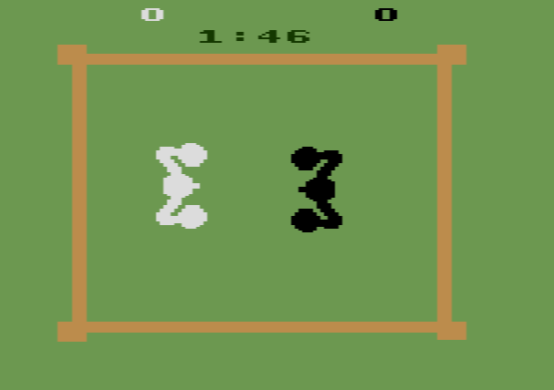

# Projeto Boxing
## FP/L.EIC, 2021/22
## Pedro Oliveira (up202108669)
## 1LEIC07

### Objetivo

1. Criar um clone do clássico Boxing de Atari 2600 em Pygame...

### Descrição

*---É um jogo de luta entre dois jogares que lutam num ringue de boxe---*

### UI

### Pacotes

- Pygame

